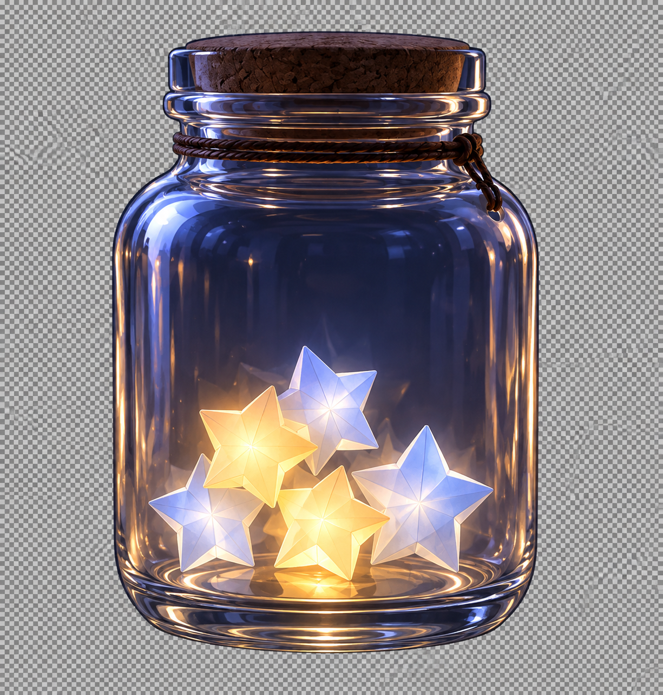

  

<h1 align="center">Kiseki</h1>

<em>Little miracles, kept.</em>

  Ένα ιδιωτικό βάζο για τις μικρές νίκες που σχεδόν ξεχνάς. 
  A quiet place for the good that almost slipped away.

  
  
  
  
  
  
  

  

  

---

## What is a Kiseki?

A Kiseki is a **small miracle** — the cup of tea you finally sat with, the kind word, the brave small step, the rest you allowed yourself.

Kiseki (奇跡) is a private jar on your device. You fold that moment into an origami star, drop it into glass, and let the night keep it. No feed. No streak. No one watching.

## The jar

One glass jar, under a Kyoto night sky. Each Kiseki is a colored origami star that falls, rests, and lives among the others. Thirty-five stars fill a jar. When it is full, you set it on the shelf and begin another — for free, without losing a thing.

Shake the jar, or simply ask it to remember. A star rises. The moment returns.

## What you keep

- **Fold a Kiseki** — a few words, a category, a color of starlight.
- **Recall** — weighted toward what has waited, still kind to what is new.
- **Memories** — every jar you have ever filled, favorites held close.
- **Wrapped** — a quiet card of your month: how many Kisekis, which path you walked, an hour that was yours.

Eight kinds of Kiseki, each with its own character in the glass: effort, kindness, rest, courage, milestone, gratitude, joy, and growth. Fourteen starlights, from moonlight to jade.

## Yours alone

Kiseki lives in this browser, on this device. There is no account, no cloud, no audience. Export a backup when you want a copy. Import it when you move. That is the whole relationship.

Install it to your home screen and it opens like a small app — still private, still yours.

## A Kyoto night

Midnight washi. Glass. Gold at the rim. A sky of constellations. The language is gentle on purpose: this is not a tracker, a score, or a race. It is a place to notice that you were here, and that it counted.

Small things. Real miracles.

